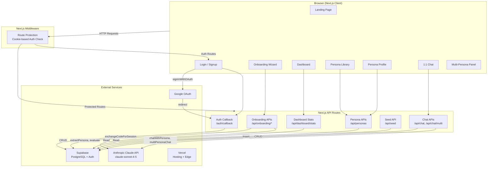

# ARCHITECTURE.md — Lens Technical Architecture

## System Architecture



## Data Flow

### Onboarding Flow (User → Persona)

```
1. User lands on /onboarding
2. Consent step → POST /api/onboarding/consent → contributors table
3. For each of 9 questions:
   a. User types answer
   b. POST /api/onboarding/evaluate → Claude scores it 1-10
   c. POST /api/onboarding/response → raw_responses table (optional, non-blocking)
   d. Score displayed with encouraging feedback
4. After Q9: comparison step
   a. POST /api/onboarding/compare → Claude generates comparison answers
   b. User sees their persona's predicted responses vs. their actual answers
5. Submit → POST /api/onboarding/complete
   a. All answers sent to extractPersona() in claude.ts
   b. Claude returns: narrative, attributes (structured JSON), confidence_scores
   c. Saved to persona_profiles table
   d. User redirected to persona profile page
```

### Chat Flow (User ↔ Persona)

```
1. User navigates to /chat/[personaId]
2. Persona profile fetched from GET /api/personas/[id]
3. User sends message → POST /api/chat
   a. Persona narrative + attributes loaded from DB
   b. Chat session created (or existing session continued)
   c. User message saved to messages table
   d. chatWithPersona() calls Claude with:
      - System prompt (from prompts.ts) with persona context
      - Conversation history (from DB or frontend fallback)
   e. Claude returns: response, confidence level, explanation
   f. Assistant message + query_logs saved to DB
4. Response rendered with confidence badge + expandable explanation
```

### Multi-Persona Panel Flow

```
1. User selects 2-5 personas on /panel
2. Types a question → POST /api/chat/multi
   a. All selected personas loaded from DB
   b. multiPersonaChat() calls Claude with all persona contexts
   c. Returns: individual responses per persona + consensus analysis
3. Results displayed as cards + consensus summary with:
   - Agreement level (strong/moderate/divided)
   - Common themes
   - Key differences
   - Key insights with confidence and supporting personas
```

### Authentication Flow

```
Email/Password Signup:
1. User submits form on /signup
2. supabase.auth.signUp() → session created immediately (no email confirmation)
3. Redirect to homepage /

Google OAuth:
1. User clicks "Continue with Google" on /login or /signup
2. supabase.auth.signInWithOAuth({ provider: 'google' })
3. Redirect to Google consent screen
4. Google redirects to /auth/callback with code
5. Server exchanges code for session via supabase.auth.exchangeCodeForSession()
6. Redirect to homepage /

Middleware Protection:
- Protected routes: /onboarding, /dashboard, /chat/*, /panel
- Unauthenticated users → redirected to /login?next=[original_path]
- Authenticated users visiting /login or /signup → redirected to /
```

## Key Components / Modules

### `src/lib/claude.ts` — AI Engine
The core AI module with three main functions:

- **`extractPersona(responses)`**: Takes Q&A pairs, sends a detailed prompt to Claude asking for structured JSON extraction of narrative, demographics, values, behavioral patterns, interests, life context, decision style, communication style, taste signals, and confidence scores. Includes JSON repair logic for malformed responses.

- **`chatWithPersona(persona, message, history)`**: Sends a chat message to Claude with a system prompt that embodies the persona's identity. Returns a response with confidence level (high/medium/low) and explanation of how the response connects to the persona's attributes.

- **`multiPersonaChat(personas, message)`**: Queries Claude to respond as multiple personas simultaneously, then generates a consensus analysis with agreement level, common themes, key differences, and actionable insights.

### `src/lib/prompts.ts` — System Prompts
Contains the system prompt template for persona chat. The prompt instructs Claude to roleplay as the persona while maintaining transparency about confidence levels and grounding responses in the persona's documented attributes.

### `src/lib/constants.ts` — Configuration
- `ONBOARDING_QUESTIONS`: 9 interview questions with labels, placeholders, and tips
- `COMPARISON_QUESTIONS`: 5 questions used to validate persona extraction
- `APP_CONFIG`: Application-wide settings

### `src/lib/validation.ts` — Zod Schemas
Input validation for all API routes: `onboardingConsentSchema`, `onboardingResponseSchema`, `personaFilterSchema`, `multiChatSchema`.

### `src/lib/supabase/server.ts` — Server Clients
Four functions for different access patterns:
- `createAdminClient()` — Service role key, bypasses RLS (for API routes)
- `createServerClient()` — Anon key, no session (for public reads)
- `createAuthClient()` — Cookie-based SSR client (for middleware/auth)
- `getAuthUser()` — Helper that returns the authenticated user or null

### `src/lib/auth-context.tsx` — Auth State
React context provider wrapping the entire app. Provides `user`, `loading`, and `signOut` via `useAuth()` hook. Listens to `onAuthStateChange` from Supabase.

### `src/stores/onboarding.ts` — Onboarding State (Zustand)
Manages the multi-step onboarding wizard: current step, answers map, scores, contributor_id, persona result, comparison data, and loading states.

### `src/stores/chat.ts` — Chat State (Zustand)
Manages chat state: messages array, session ID, persona info, loading state.

## State Management

| Scope | Tool | Location |
|-------|------|----------|
| Global auth | React Context | `src/lib/auth-context.tsx` |
| Onboarding wizard | Zustand | `src/stores/onboarding.ts` |
| Chat conversation | Zustand | `src/stores/chat.ts` |
| Page-local UI state | React useState | Individual page components |
| Server state | Supabase DB | Fetched via API routes |

## API Endpoints

### Onboarding

| Method | Route | Description | Request | Response |
|--------|-------|-------------|---------|----------|
| POST | `/api/onboarding/consent` | Record consent | `{ consent: boolean }` | `{ contributor_id, consent_status }` |
| POST | `/api/onboarding/response` | Save one answer | `{ contributor_id, question_number, response_text }` | `{ response_id, saved: true }` |
| POST | `/api/onboarding/evaluate` | AI-score answer | `{ question_index, answer }` | `{ score, max_score: 10, feedback }` |
| POST | `/api/onboarding/complete` | Extract persona | `{ contributor_id?, answers? }` | `{ persona_id, narrative, attributes, confidence_scores }` |
| POST | `/api/onboarding/compare` | Comparison answers | `{ answers }` | `{ responses: string[] }` |

### Personas

| Method | Route | Description | Request | Response |
|--------|-------|-------------|---------|----------|
| GET | `/api/personas` | List personas | Query: `search`, `decision_style`, `values`, `life_context` | `{ personas: [...], total }` |
| GET | `/api/personas/[id]` | Get one persona | — | `{ id, narrative, attributes, confidence, version }` |

### Chat

| Method | Route | Description | Request | Response |
|--------|-------|-------------|---------|----------|
| POST | `/api/chat` | Chat with persona | `{ persona_id, message, session_id?, history? }` | `{ session_id, response, confidence, explanation, latency_ms }` |
| POST | `/api/chat/multi` | Multi-persona query | `{ persona_ids: string[], message }` | `{ responses: [...], consensus, latency_ms }` |

### Dashboard

| Method | Route | Description | Response |
|--------|-------|-------------|----------|
| GET | `/api/dashboard/stats` | Get stats | `{ total_personas, total_sessions, total_messages, avg_latency_ms }` |

### Utility

| Method | Route | Description |
|--------|-------|-------------|
| POST | `/api/seed` | Seed 4 demo personas |

## Database Schema

```mermaid
erDiagram
    auth_users ||--o{ contributors : "user_id"
    auth_users ||--o{ persona_profiles : "user_id"
    auth_users ||--o{ chat_sessions : "user_id"
    contributors ||--o{ raw_responses : "contributor_id"
    contributors ||--o{ persona_profiles : "contributor_id"
    persona_profiles ||--o{ chat_sessions : "persona_id"
    chat_sessions ||--o{ messages : "session_id"
    chat_sessions ||--o{ query_logs : "session_id"
    messages ||--o{ query_logs : "message_id"

    contributors {
        uuid id PK
        text consent_status
        uuid user_id FK "nullable"
        timestamptz created_at
    }

    raw_responses {
        uuid id PK
        uuid contributor_id FK
        int question_number
        text response_text
        timestamptz created_at
        unique "contributor_id, question_number"
    }

    persona_profiles {
        uuid id PK
        uuid contributor_id FK "nullable"
        uuid user_id FK "nullable"
        text narrative
        jsonb attributes_json
        jsonb confidence_scores
        boolean published "default false"
        int version "default 1"
        timestamptz created_at
    }

    chat_sessions {
        uuid id PK
        uuid persona_id FK
        uuid user_id FK "nullable"
        text title
        timestamptz created_at
    }

    messages {
        uuid id PK
        uuid session_id FK
        text role "user or assistant"
        text content
        text confidence "nullable"
        text explanation "nullable"
        timestamptz created_at
    }

    query_logs {
        uuid id PK
        uuid session_id FK
        uuid message_id FK "nullable"
        text model_used
        int latency_ms
        int tokens
        timestamptz created_at
    }
```

### Tables

1. **contributors** — Tracks consent from people contributing to persona creation
2. **raw_responses** — Individual answers to onboarding questions (unique per contributor+question)
3. **persona_profiles** — The extracted persona with narrative, structured attributes (JSONB), and confidence scores
4. **chat_sessions** — Groups of messages in a conversation with a persona
5. **messages** — Individual chat messages (user + assistant) with optional confidence metadata
6. **query_logs** — Performance tracking (latency, model used) for each AI query

### RLS (Row Level Security)
- All 6 tables have RLS enabled
- Current policies are permissive ("always true") — adequate for MVP
- `user_id` columns added to `contributors`, `persona_profiles`, and `chat_sessions` via migration 002
- Future: Tighten to proper user-scoped policies

## Third-Party Integrations

| Service | Purpose | SDK/Package |
|---------|---------|-------------|
| **Anthropic Claude** | Persona extraction, answer scoring, chat, multi-persona analysis | `@anthropic-ai/sdk` 0.52.0 |
| **Supabase** | PostgreSQL database, authentication, RLS | `@supabase/supabase-js` 2.49.4, `@supabase/ssr` 0.8.0 |
| **Google OAuth** | Social login | Via Supabase Auth provider |
| **Vercel** | Hosting, CI/CD, edge functions | Auto-deploy from GitHub |

## Authentication / Authorization Flow

### Architecture

```
Browser                     Middleware                  API Routes
  │                            │                           │
  │─── Request ───────────────>│                           │
  │                            │── Check cookies ──>       │
  │                            │   (createAuthClient)      │
  │                            │                           │
  │                            │── Protected route?        │
  │                            │   No user? → /login       │
  │                            │   Has user? → Continue    │
  │                            │                           │
  │                            │───────────────────────────>│
  │                            │                           │── getAuthUser()
  │                            │                           │   (optional, for
  │                            │                           │    user_id linking)
  │                            │                           │
  │                            │                           │── createAdminClient()
  │                            │                           │   (bypasses RLS for
  │                            │                           │    all DB operations)
```

### Key Points

- **Middleware** (`src/middleware.ts`) runs on every non-static, non-API, non-auth request
- Uses `createServerClient` from `@supabase/ssr` to read auth cookies
- Protected routes: `/onboarding`, `/dashboard`, `/chat/*`, `/panel`
- Auth routes: `/login`, `/signup` (redirects to `/` if already logged in)
- API routes use `getAuthUser()` optionally to link data to users, but all DB operations use the admin client (service role key) which bypasses RLS
- `signOut` in `auth-context.tsx` redirects to homepage `/`
- Email confirmation is disabled — signup creates session immediately
